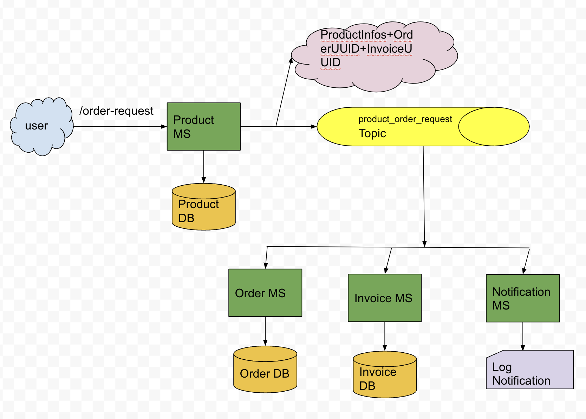

# spring-boot-event-driven-system
A Sample Event Driven System built with Spring Boot

This is a sample Event Driven System built with Spring Boot. It includes 4 microservices. The product MS first receives the order request. The request can be for multiple products, alongside the desired quantity for each of them. The inventory of the respective products are reduced in the Product MS. A json message is put to a kafka topic (product_order_request). This message consists of a Product infos + their respective requested quantity and generated order and invoice UUIDs. The other 3 microservices (Order MS, Invoice MS & Notification MS) consume these message from the topic and perform their respective actions. Order MS generates order. Invoice MS generates invoice and Notification MS logs notifications (can be later extended to send actual notifications via 3rd party systems). Product MS responds back the order id and invoice id (generated UUIDs) to the user,
which the user can later use to look them up from the respective microservice endpoints.

Stack
========
Java, Spring Boot, Kafka, MongoDB

Architectural Diagram
======================

